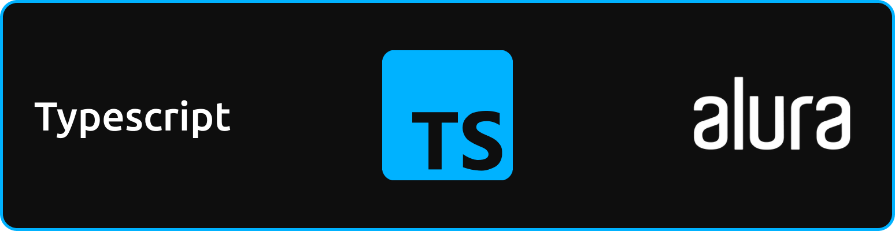

# CRIADOR
- **[Kaique Rodrigues Zaffarani](https://github.com/Z4ffarani)**

 

# INTRODUÇÃO
O desenvolvimento de software moderno exige ferramentas que ajudem a criar aplicações robustas, escaláveis e fáceis de manter. **[TypeScript](https://www.typescriptlang.org/)** é uma dessas ferramentas, uma linguagem que expande o JavaScript adicionando tipagem estática opcional, interfaces e outros recursos que tornam o desenvolvimento mais eficiente.

Ao combinar a flexibilidade do JavaScript com a robustez da tipagem estática, TypeScript se tornou uma escolha popular entre desenvolvedores para projetos de todos os tamanhos. Ele ajuda a reduzir erros, melhorar a legibilidade do código e fornecer uma base sólida para o desenvolvimento em equipe.

 

# FUNDAMENTOS
- **Tipagem Estática** | A tipagem em TypeScript permite especificar os tipos de variáveis, parâmetros e retornos de funções, ajudando a capturar erros durante o desenvolvimento em vez de no tempo de execução.

- **Interfaces e Tipos** | TypeScript oferece a possibilidade de definir contratos para objetos e funções, promovendo consistência e documentação automática no código.

- **Classes e Herança** | Baseado no padrão de orientação a objetos, TypeScript facilita a criação de classes, herança e encapsulamento, tornando-o ideal para aplicações grandes e escaláveis.

- **Ferramentas Avançadas de IDE** | Com recursos como IntelliSense e verificação de tipos em tempo real, TypeScript melhora significativamente a experiência do desenvolvedor, permitindo a detecção de erros antes mesmo de executar o código.

 

# DESENVOLVIMENTO
- **Aplicações Web Modernas** | TypeScript é amplamente utilizado no desenvolvimento de aplicações web com frameworks como **[Angular](https://angular.io/)**, **[React](https://reactjs.org/)** e **[Vue](https://vuejs.org/)**. A tipagem ajuda a gerenciar estados, propriedades e interações complexas.

- **APIs e Backends** | TypeScript, em conjunto com bibliotecas como **[Express](https://expressjs.com/)** ou frameworks como **[NestJS](https://nestjs.com/)**, facilita a criação de APIs seguras e bem estruturadas.

- **Automação e Ferramentas** | Seja para criar scripts ou automação de tarefas, TypeScript oferece segurança adicional em comparação ao JavaScript puro, reduzindo erros em scripts complexos.

- **Bibliotecas e Pacotes** | Desenvolver bibliotecas com TypeScript garante que os consumidores tenham acesso a interfaces bem definidas e a verificação de tipos ao integrar seus pacotes.

- **Migração de Projetos Legados** | TypeScript pode ser adotado gradualmente em projetos existentes, permitindo que equipes aproveitem os benefícios da tipagem estática sem uma reescrita completa.

 

# VANTAGENS
- **Confiabilidade** | A tipagem estática ajuda a identificar erros no desenvolvimento, reduzindo bugs em produção.
  
- **Manutenibilidade** | Código mais claro e legível facilita a colaboração em equipe e a manutenção de longo prazo.
  
- **Compatibilidade** | TypeScript é um superconjunto de JavaScript, o que significa que qualquer código JavaScript válido também é válido em TypeScript.
  
- **Ecossistema** | Compatível com as ferramentas e bibliotecas JavaScript existentes, TypeScript se integra facilmente ao fluxo de trabalho.

 

# CONCLUSÃO
O uso de TypeScript representa um passo à frente no desenvolvimento moderno, oferecendo um equilíbrio ideal entre flexibilidade e robustez. Ele não só melhora a qualidade do código, mas também torna a experiência do desenvolvedor mais eficiente e produtiva. Seja para projetos pessoais ou grandes sistemas corporativos, TypeScript é uma escolha que agrega valor e segurança ao desenvolvimento.

 

# OBSERVAÇÕES
- Este projeto consiste em uma coleção de anotações realizadas durante aulas ao longo de videoaulas da **[Alura](https://www.alura.com.br/?utm_term=alura&utm_campaign=%5BSearch%5D+%5BPerformance%5D+-+Institucional&utm_source=google&utm_medium=cpc&utm_content=609948692827&campaign_id=386166608_21666755648_609948692827&utm_id=386166608_21666755648_609948692827&hsa_acc=7964138385&hsa_cam=%5BSearch%5D+%5BPerformance%5D+-+Institucional&hsa_grp=21666755648&hsa_ad=609948692827&hsa_src=g&hsa_tgt=kwd-300088401&hsa_kw=alura&hsa_mt=e&hsa_net=google&hsa_ver=3&gad_source=1&gclid=CjwKCAiA65m7BhAwEiwAAgu4JKA_xwlBK6BLcdPEliLYmf3svHoJL4f4rOCJ98_Nk80YGrC2CTePKBoCj5kQAvD_BwE)**. Inclui conceitos principais de TypeScript, exemplos práticos e exercícios resolvidos. O objetivo é consolidar o conhecimento e servir como material de referência para estudos futuros.
